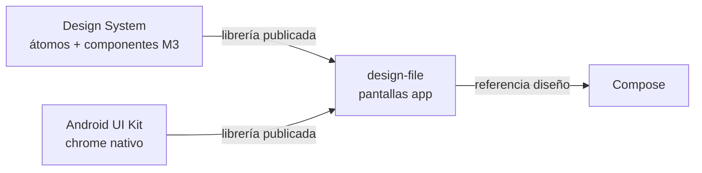

# Figma — Archivos y librerías

Tres archivos con roles distintos. **No confundir** el design file (pantallas) con el design system (librería de componentes).

## Resumen

| Archivo | fileKey | Rol |
|---------|---------|-----|
| **[MyOwnTrip_design-file](https://www.figma.com/design/Vf2tNMXyKAlJSV53A1v4Is/MyOwnTrip_design-file?node-id=0-1)** | `Vf2tNMXyKAlJSV53A1v4Is` | **Fuente de verdad del diseño de la app** — todas las pantallas y flujos (personas + IA / MCP) |
| **[MyOwnTrip_nativo — Design System](https://www.figma.com/design/zrGAL4v6MEMc9hzZemU432/MyOwnTrip_nativo---Design-System?node-id=61084-30365)** | `zrGAL4v6MEMc9hzZemU432` | **Librería** — átomos, building blocks y componentes compuestos publicados |
| **[MyOwnTrip_Andorid-UI](https://www.figma.com/design/WyjZMISihVMTMg5RYSJWba/MyOwnTrip_Andorid-UI?node-id=295-27587)** | `WyjZMISihVMTMg5RYSJWba` | **Librería auxiliar** — chrome Android (Community, tokenizado); instancias ya hechas cuando hagan falta |

---

## 1. MyOwnTrip_design-file — diseño de la app

- **URL:** [MyOwnTrip_design-file](https://www.figma.com/design/Vf2tNMXyKAlJSV53A1v4Is/MyOwnTrip_design-file?node-id=0-1)
- **Qué es:** archivo de **trabajo de producto** — wireframes, mockups hi-fi, exploraciones y pantallas finales.
- **Fuente de verdad** para diseñadores y para **IA** cuando se diseña vía MCP: aquí se componen las pantallas, no en el DS.
- **Consume** instancias de las dos librerías (DS M3 + Android UI Kit cuando aplique).
- **No** es un catálogo de componentes: no duplicar sets del DS salvo excepción documentada.

**Al pedir diseño de pantallas:** abrir y editar **este** archivo.

---

## 2. MyOwnTrip_nativo — Design System — librería M3

- **URL:** [MyOwnTrip_nativo — Design System](https://www.figma.com/design/zrGAL4v6MEMc9hzZemU432/MyOwnTrip_nativo---Design-System?node-id=61084-30365)
- **Qué es:** librería Material 3 editorial MyOwnTrip — variables, estilos y **component sets**.
- **Capas:** átomos (tokens, iconos) → building blocks → componentes compuestos (botón, card, campo, chips, navegación…).
- **Origen técnico:** M3 Community podado · Bridge → `variables.json` → `Color.kt` / Compose.
- **Uso:** crear y mantener componentes; **publicar** como librería de equipo; el design-file solo **instancia**.
- **Prohibido** en este archivo: láminas de documentación de componentes (ADR 003) — docs en showcase externo.

---

## 3. MyOwnTrip_Andorid-UI — Android UI Kit (auxiliar)

- **URL:** [MyOwnTrip_Andorid-UI](https://www.figma.com/design/WyjZMISihVMTMg5RYSJWba/MyOwnTrip_Andorid-UI?node-id=295-27587)
- **Origen:** fork de [Android UI Kit (Community)](https://www.figma.com/design/WyjZMISihVMTMg5RYSJWba/%F0%9F%A7%B0-Android-UI-Kit--Community-?node-id=341-27123), paleta MyOwnTrip en colecciones `Content` + `AOSP`.
- **Qué aporta:** patrones y piezas **nativas Android** que el DS M3 no modela: status/navigation bar, permisos, share sheet, marcos de dispositivo, etc.
- **Catálogo SO (solo prototipo / referencia):** lock screen, widgets, notification shade, AOD — útiles en Figma para contexto; **no** se implementan en la app (las pinta el sistema).
- **Uso en design-file:** instanciar **solo** lo que aporte al flujo (p. ej. diálogo de permiso de cámara en Journal), no migrar el kit entero.

**Estado tokens (jun 2026):** `Schemes/*` (6 modos) desde `M3_MOTrip.json` + tokens chrome AOSP — scripts en `.cursor/skills/myowntrip-ds-audit/scripts/`.

**Pendiente:** publicar como librería de equipo y suscribir desde design-file.

---

## Cuándo usar qué

| Necesitas | Dónde |
|-----------|--------|
| Diseñar / iterar una pantalla de la app | **design-file** |
| Crear o editar un componente reutilizable | **Design System** → publicar → usar en design-file |
| Status bar, permiso sistema, share sheet, device frame | **Android UI Kit** → instancia en design-file |
| Tokens / tema / export a Compose | **Design System** → `variables.json` |
| Motion / morph botón (Expressive) | HTML preview + Compose (no Figma) |

---

## MCP / IA

Al generar o editar UI en Figma:

1. **Archivo objetivo:** `Vf2tNMXyKAlJSV53A1v4Is` (design-file).
2. **Componentes:** `search_design_system` / librerías publicadas — DS primero, Android UI Kit si hace falta chrome.
3. **No** construir pantallas de producto dentro del archivo DS (`zrGAL4v6MEMc9hzZemU432`).

**Notion:** [Figma — Librerías M3 + Android UI Kit](https://www.notion.so/37d6a48d93c881fbbe45f9f4894b7eff)
